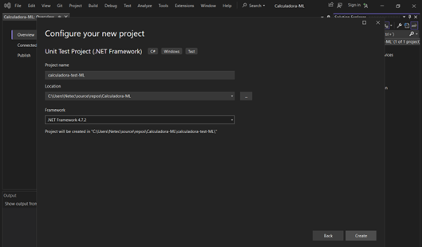

# CAPÍTULO 2. Pruebas Unitarias
## Calculadora I


## Objetivos
Al finalizar la práctica, serás capaz de:
- Validar y verificar el comportamiento y funcionalidad de los métodos básicos implementados en la aplicación "_Calculadora_"
- Realizar pruebas unitarias

### Duración aproximada 40 minutos<br>


## Instrucciones 

1. ### Crear un nuevo proyecto Web.
    1. Abre Visual Studio 2022.
    2. Haz click en **Crear un nuevo proyecto**

    

    3. Selecciona **Aplicación web de APS.NET (Razor Pages)** y haz clic en **Siguiente**
    

    4. Nombre a tu proyecto _Calculadora_, seguido de tus iniciales y haz clic en **Crear**
    

    5. En la siguiente ventana, no hagas modificaciones extras y selecciona **Crear**<br>
    

    6. Selecciona **Solución** y da click derecho; posterior selecciona **Añadir** y **Nuevo proyecto**
    

    7. En la nueva ventana busca en la parte superior **Test** para encontrar Proyecto pruebas Unit; selecciónalo y da click en **Siguiente**
    

    8. Ingresa el nombre del proyecto como **Calculadora-test-iniciales** y da clic en **Crear**
    

2. ### Añade la aplicación Calculadora
    1. En el explorador de soluciones, se muestra una carpeta _Pages_. Selecciona los archivos que se encuentran ahí y elimina todo.
    

    2. Da clic derecho en la carpeta **Pages**, y selecciona **Añadir** y después **Nuevo elemento**
    

    3. Selecciona **Página HTML**, nombralo _Index.html_ y selecciona **Agregar**.
    

    4. Selecciona el contendio de código, elimina el contenido y sustitúyelo con el siguiente código. 

    ```html
    <!DOCTYPE html>
    <html lang="es">
    <head>
    <meta charset="UTF-8">
    <title>Calculadora Simple</title>
    <style>
        /* Estilos básicos para la calculadora */
        .calculator {
            width: 320px;
            margin: auto;
            padding: 20px;
            border: 1px solid #ccc;
            border-radius: 5px;
            box-shadow: 0 0 10px rgba(0, 0, 0, 0.1);
        }
        input[type="text"] {
            width: 90%;
    padding: 10px;
            margin-bottom: 10px;
        }
        button {
            width: 50px;
            height: 50px;
            margin: 5px;
        }
    </style>
    </head>
    <body>
    <div class="calculator">
        <h2>Calculadora básica:</h2>
        <input type="text" id="display" readonly>
    <br>
    <button id="button1" onclick="addToDisplay('1')">1</button>
    <button id="button2" onclick="addToDisplay('2')">2</button>
     <button id="button3" onclick="addToDisplay('3')">3</button>
     <button id="buttonsuma" onclick="addToDisplay('+')">+</button>
     <br>
     <button id="button4" onclick="addToDisplay('4')">4</button>
     <button id="button5" onclick="addToDisplay('5')">5</button>
     <button id="button6" onclick="addToDisplay('6')">6</button>
     <button id="buttonresta" onclick="addToDisplay('-')">-</button>
     <br>
     <button id="button7" onclick="addToDisplay('7')">7</button>
     <button id="button8" onclick="addToDisplay('8')">8</button>
     <button id="button9" onclick="addToDisplay('9')">9</button>
     <button id="buttonmultiplica" onclick="addToDisplay('*')">*</button>
     <br>
    <button id="button0" onclick="addToDisplay('0')">0</button>
    <button onclick="clearDisplay()">C</button>
    <button onclick="calculate()">=</button>
    <button onclick="addToDisplay('/')">/</button>
    </div>
    <script>
        // Lógica para la calculadora
        function addToDisplay(value) {
            document.getElementById('display').value += value;
        }
        function clearDisplay() {
            document.getElementById('display').value = '';
        }
        function calculate() {
            try {
                const result = eval(document.getElementById('display').value);
                document.getElementById('display').value = result;
            } catch (error) {
                document.getElementById('display').value = 'Error';
            }
        }
    </script>
    </body>
    </html>
    ```

    5. Guarda los cambios. Da clic derecho sobre el archivo _index.html_ y selecciona **Abrir carpeta contenedora**
    

    6. Con esto, se abrirá una carpeta; selecciona **Index**<br>
    

    7. Finalmente, se mostrará una página web como la siguiente: 
    


3. ### Realiza las siguientes prueba unitarias manuales.
    1. Valida que se encuentren los números del 0 al 9. 
    2. **Valida la función suma**. Realiza las sumas y valida los resultados. 
    ```
    4+5=9
    16+49=65
    ```

    3. **Valida la función resta**. Realiza las restas y valida los resultados. 
    ```
    4-5=-1
    49-19=30
    ```

    4. **Valida la función multiplicación** Realiza las multiplicaciones y valida los resultados:
    ```
    38*5=190
    456*753=343368
    ```
    5. **Valida la función división**. Realiza las divisiones y valida los resultados. 
    ```
    270/3=90
    ```

4. ### Realiza pruebas con NUnit
    1. Da clic derecho sobre el proyecto y selecciona **Administrar paquetes NuGet**
    

    2. Selecciona **Examinar**; busca y añade los siguientes paquetes
        - **NUnit**
        - **NUnit3TestAdapter**
        - **Selenium.WebDriver**
        - **Selenium. WebDriver.MSEdgeDriver**
        - **Selenium. WebDriver.IEDriver**
        - **Selenium.Support**
    

    3. Ingresa al archivo _UnitTest1_ y copia el siguiente código:

    ```C#
    using NUnit.Framework;
    using OpenQA.Selenium;
    using OpenQA.Selenium.Edge;
    using System.Threading;
    namespace Calculadora_Test.Tests
    {
        [TestFixture]
        public class Test1
        {
            private readonly string site;
            public Test1()
            {
                //Sigue las instrucciones para añadir la liga de acuerdo a tu computador
                site = "---";
            }
            [Test]
            public void TestMethod1()
            {
                using (var driver = new EdgeDriver())
                {
                    try {
                        // Aquí puedes agregar acciones adicionales si es necesario
                        // Para la instrucción 5 se elimina la información de aquí y se sustituye por el codigo mencionado
                        driver.Url = site;
                        Thread.Sleep(5000);
                    }
                    finally {
                        driver.Quit();
                    }
                }
            }
        }
    }
    ```

    4. Dentro del código en la línea 16, se muestra la variable: “site”. Este es un enlace para abrir nuestra página web y poder realizar las pruebas necesarias. 
        - Para encontrar el enlace correspondiente a tu ordenador, desde el Explorador de soluciones, da clic derecho en el proyecto _Calculadora_ y selecciona **Abrir carpeta en el Explorador de archivos.**
        

        - Abrirá una carpeta con toda la documentación. Da clic derecho y selecciona **Abrir.**
        

        - Se abrirá una página web y copia el enlace de la parte superior. 
        

        - Regresa a Visual Studio y sustituye el enlace entre las comillas “---”.
        

    5. Da clic derecho en el archivo _UniTest1_, y selecciona **Ejecutar pruebas**. 
        
    
    6. Se abrirá una nueva ventana y 5 segundos después se cerará de forma automática. 
    

    7. Al cerrarse la ventana de _Calculadora_, mostrará un Explorador de pruebas mencionando si la prueba fue **correcta** o **incorrecta**. Dado que sólo queremos validar que se pueda abrir la página web, esta se mostrará como correcta.
    


5. ### Realiza una prueba para validar que la calculadora tenga 16 botones. 
    1. Con el Id de cada botón, se buscará cada elemento. Esta validación se hará con medio segundo de diferencia entre cada botón. Para que sea visible, se eligen algunos elementos para mostrarse. Debajo de _Thread.Sleep_, añade el siguiente código:

    ```C#
    var element = driver.FindElement(By.Id("button1"));
    element.Submit();
    Thread.Sleep(500);
    var element1 = driver.FindElement(By.Id("button2"));
    element1.Submit();
    Thread.Sleep(500);
    var element2 = driver.FindElement(By.Id("button3"));
    element2.Submit();
    Thread.Sleep(500);
    var element3 = driver.FindElement(By.Id("button4"));
    element3.Submit();
    Thread.Sleep(500);
    var element4 = driver.FindElement(By.Id("button5"));
    element4.Submit();
    Thread.Sleep(500);
    var element5 = driver.FindElement(By.Id("button6"));
    element5.Submit();
    Thread.Sleep(500);
    var element6 = driver.FindElement(By.Id("button7"));
    element6.Submit();
    Thread.Sleep(500);
    var element7 = driver.FindElement(By.Id("button8"));
    element7.Submit();
    Thread.Sleep(500);
    var element8 = driver.FindElement(By.Id("button9"));
    element8.Submit();
    Thread.Sleep(500);
    var element9 = driver.FindElement(By.Id("button0"));
    element9.Submit();
    Thread.Sleep(500);
    var element11 = driver.FindElement(By.Id("buttonsuma"));
    Thread.Sleep(500);
    var element12 = driver.FindElement(By.Id("buttonresta"));
    Thread.Sleep(500);
    var element13 = driver.FindElement(By.Id("buttonmultiplica"));
    Thread.Sleep(500);
    var element14 = driver.FindElement(By.Id("buttondivide"));
    Thread.Sleep(500);
    var element15 = driver.FindElement(By.Id("buttoncalcula"));
    element15.Submit();
    Thread.Sleep(500);
    var element16 = driver.FindElement(By.Id("buttonborra"));
    element16.Submit();
    Thread.Sleep(500);
    ```

    2. Se guarda y se vuelve a hacer la prueba esperando que se haga de forma correcta.
    > **Note**:
    > La prueba saldrá fallida, lo cual es correcto. Es el momento para validar: ¿Por qué? Se ha mencionado que se requiere que cada botón tenga un ID, pero hay algunos que no están “añadidos” en el Index.<br>


    3. Regresa al archivo _Index_, identifica los botones que no tienen ID, añádelos, guarda el archivo y realiza nuevamente la prueba. Ahora la prueba funcionará correctamente.


### Solución o producto final:


La prueba debe ser correcta. La duración puede variar unos segundos dependiendo de la velocidad de la máquina donde se realiza la prueba. 
