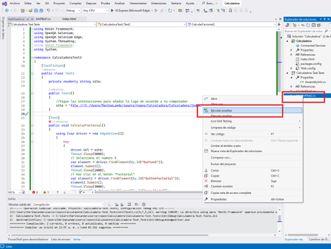

# CAPÍTULO 3. Pruebas de Integración
## Calculadora II


## Objetivos
Al finalizar la práctica, serás capaz de:
- Validar la interacción entre métodos, comprobar la coherencia del sistema y detectar problemas de integración. 
- Probar cómo diferentes componentes o módulos de tu aplicación interactúan entre sí

### Duración aproximada 40 minutos


## Instrucciones 
1. ### Regresa al archivo _Index.html_ y añade:
    1. En **Body**, después del botón: _buttondivide_

    ```html
    <h2>Funciones avanzadas:</h2>
    <p>
        Factorial.
        <button id="buttonfactorial" onclick="calcularFactorial()">Calcula</button>

        <h2>Resultados</h2>
    <p id="resultado"></p>
    ```

    2. En **Script**: 
    ```javascript
    // Lógica para la calculadora
    function addToDisplay(value) {
        document.getElementById('display').value += value;
    }

    function clearDisplay() {
        document.getElementById('display').value = '';
    }

    function calculate() {
        try {
            let result = eval(document.getElementById('display').value);
            document.getElementById('resultado').innerText = `${result}`;
        } catch (error) {
            document.getElementById('resultado').value = 'Error';
        }
    }
    function calcularFactorial() {
        // Obtener el número ingresado por el usuario
        let numero = document.getElementById('display').value;

        // Validar que el usuario haya ingresado un número
        if (numero === '') {
            alert('Por favor, ingrese un número.');
         return;
        }
            // Convertir el número a entero
    numero = parseInt(numero);

    // Verificar si el número es válido (no negativo)
    if (numero < 0) {
        alert('Ingrese un número no negativo para calcular el factorial.');
        return;
    }

    // Calcular el factorial del número
    let factorial = 1;
    for (let i = 1; i <= numero; i++) {
        factorial *= i;
    }

    // Mostrar el resultado en la interfaz
    document.getElementById('resultado').innerText = `${factorial}`;
    }

    ```

2. ### Añade una nueva prueba
    1. Da clic derecho en el proyecto pruebas, selecciona **Agregar** y **Nuevo elemento**
    

    2. Selecciona en **Prueba**, la opción de **Prueba unitaria**
    > **NOTE**:
    > Realizaremos una prueba de integración; sin embargo, el tipo de formato que maneja Visual Studio permite realizar otro tipo de pruebas con el formato: Prueba unitaria. 

    

    3. Da clic derecho sobre el proyecto y selecciona **Administrar paquetes NuGet.**
    4. Selecciona **Examinar**, busca y añade el paquete **Xunit**
    

    5. Selecciona el archivo _"UnitTest2"_ y añade el siguiente código:
    ```C#
    using NUnit.Framework;
    using OpenQA.Selenium;
    using OpenQA.Selenium.Edge;
    using System.Threading;
    using System;

    namespace CalculadoraTest2
    {
        [TestFixture]
        public class Test2
        {

            private readonly string site;
            public Test2()
            {
                //Sigue las instrucciones para añadir la liga de acuerdo a tu computador
                site = "URL";
            }

            [Test]
            public void CalcularFactorial()
            {
                using (var driver = new EdgeDriver())
                {
                    try
                    {
                        driver.Url = site;
                        Thread.Sleep(5000);
                        // Selecciona el número 5
                        var element = driver.FindElement(By.Id("button5"));
                element.Submit();
                        Thread.Sleep(1000);
                        // Haz clic en el botón "Factorial"
                        var element2 = driver.FindElement(By.Id("buttonfactorial"));
                        element2.Submit();
                        Thread.Sleep(3000);  
                        var element3 = driver.FindElement(By.Id("resultado"));
                        string actualResult = element3.Text;

                        if (!actualResult.Equals("120"))
                        {
                            throw new Exception($"El resultado esperado es '120', pero se obtuvo '{actualResult}'.");
                        }


                    }
                    finally                                                    
                    {
                        driver.Quit();
                    }
                }
            }
        }
    }
    ```
    6. Da clic derecho en el archivo _UnitTest2_ y selecciona **Ejecutar pruebas**
      

    7. La prueba saldrá correcta
     

    8. Modifica el resultado esperado y repite el proceso de ejecución de prueba para validar que la prueba sale errónea.
      

    9. Repite el proceso, pero en este caso selecciona un número diferente para el factorial y mensaje de error, por ejemplo: #3 y mensaje: Resultado incorrecto.

        - Para una prueba aprobatoria, el resultado se vería de la siguiente forma:
          

        - Para una prueba con error, el resultado se vería:
         


### Solución o producto final: 
- Para una prueba aprobatoria:
    

- Para una prueba con error


