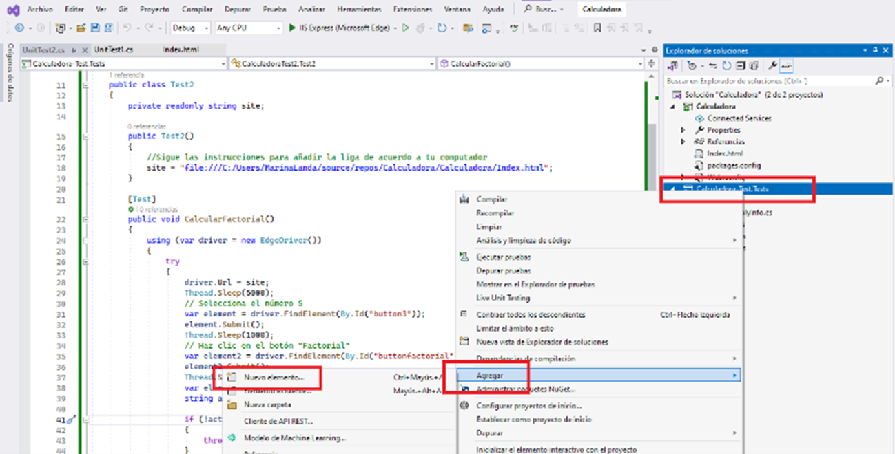
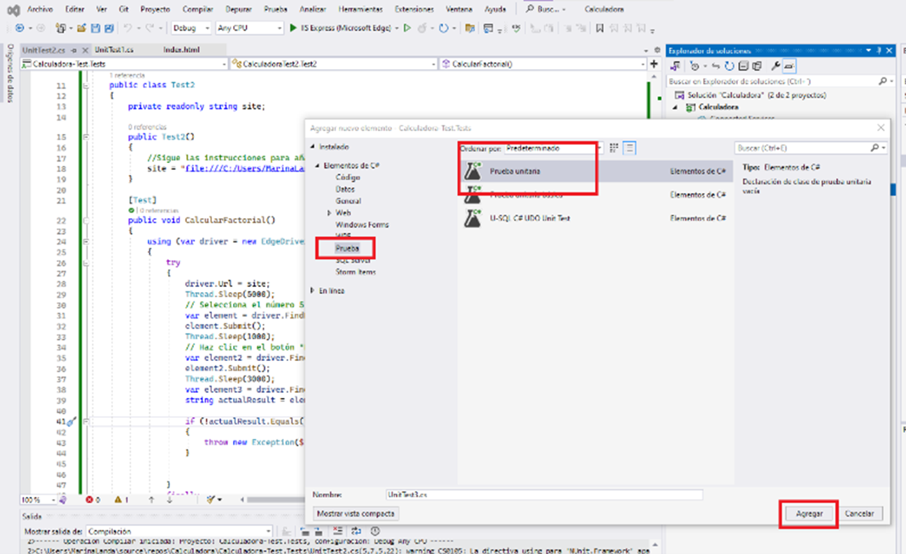
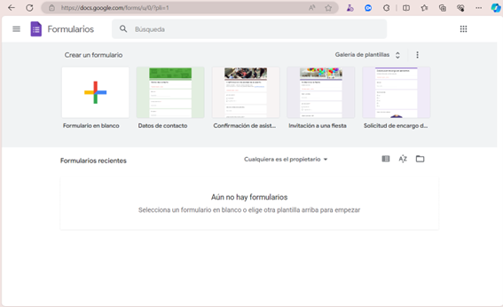
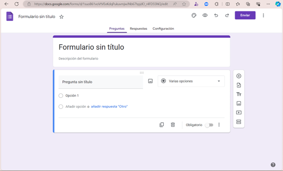
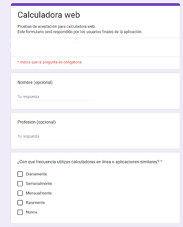
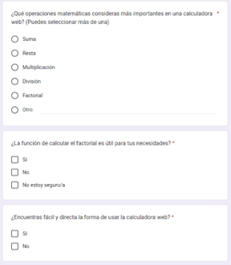
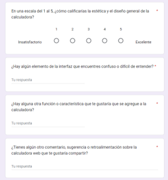
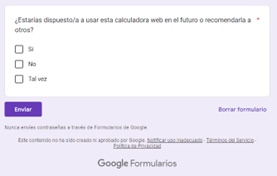
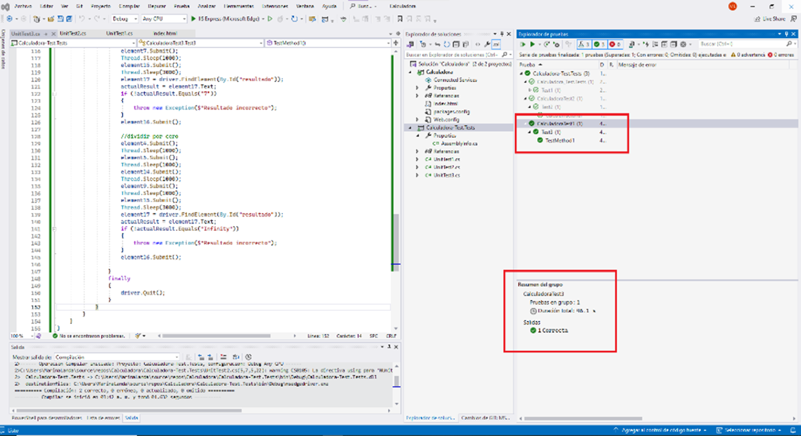
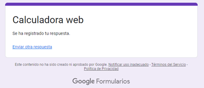

# Capítulo 4. Pruebas de Sistema y Aceptación
## Calculadora III

## Objetivos
- Comprobar las funciones de la calculadora, evaluar las situaciones excepcionales.
- Confirmar que la calculadora satisface las expectativas del usuario final.

### Duración aproximada: 40 minutos

## Instrucciones 

1. ### Añade pruebas de sistemas
    1. Abre nuevamente **Visual Studio**

    2. Da clic derecho en el proyecto _Calculadora-Test_, selecciona **Agregar** y **Nuevo elemento**
    

    3. Selecciona **prueba unitaria** y da clic en **Agregar**
    

    4. Validar cada una de las funciones de la calculadora. 
        - **Suma**
            - Abre el archivo _UnitTest3_. 
            - Copia el siguiente código. 
            ```C#
            using NUnit.Framework;
            using OpenQA.Selenium;
            using OpenQA.Selenium.Edge;
            using System;
            using System.Threading;
            namespace CalculadoraTest3
            {
                [TestFixture]
                public class Test3
                {
                    private readonly string site;
                    public Test3()
                    {
                        //Sigue las instrucciones para añadir la liga de acuerdo a tu computador
                        site = "URL";
                    }
                    [Test]
                    //Prueba para validar que abre la pag.
                    public void TestMethod1()
                    {
                        using (var driver = new EdgeDriver())
                        {
                            try
                            {
                                driver.Url = site;
                                var element = driver.FindElement(By.Id("button1"));
                                var element1 = driver.FindElement(By.Id("button2"));
                                var element2 = driver.FindElement(By.Id("button3"));
                                var element3 = driver.FindElement(By.Id("button4"));
                                var element4 = driver.FindElement(By.Id("button5"));
                                var element5 = driver.FindElement(By.Id("button6"));
                                var element6 = driver.FindElement(By.Id("button7"));
                                var element7 = driver.FindElement(By.Id("button8"));
                                var element8 = driver.FindElement(By.Id("button9"));
                                var element9 = driver.FindElement(By.Id("button0"));
                                var element11 = driver.FindElement(By.Id("buttonsuma"));
                                var element12 = driver.FindElement(By.Id("buttonresta"));
                                var element13 = driver.FindElement(By.Id("buttonmultiplica"));
                                var element14 = driver.FindElement(By.Id("buttondivide"));
                                var element15 = driver.FindElement(By.Id("buttoncalcula"));
                                var element16 = driver.FindElement(By.Id("buttonborra"));
                                //suma 459+681=1140
                                element3.Submit();
                                element4.Submit();
                                element8.Submit();
                                element11.Submit();
                                element5.Submit();
                                element7.Submit();
                                element.Submit();
                                element15.Submit(); 
                                element9.Submit();
                                var element17 = driver.FindElement(By.Id("display"));
                                string actualResult = element17.Text;

                                if (!actualResult.Equals("1140"))
                                {
                                    throw new Exception($"Resultado incorrecto");
                                }
                                element16.Submit();
                                }
                            finally
                            {
                                driver.Quit();
                            }
                        }
                    }
                }
            }

            ```
        - **Resta**
            - Después de la suma, añade el código correspondiente a la resta. **No añadir otra prueba unitaria.** 
            ```C#
            element.Submit();
            Thread.Sleep(1000);
            element4.Submit();
            Thread.Sleep(1000);
            element12.Submit();
            Thread.Sleep(1000);
            element7.Submit();
            Thread.Sleep(1000);
            element15.Submit();
            Thread.Sleep(3000);
            element17 = driver.FindElement(By.Id("resultado"));
            actualResult = element17.Text;
            if (!actualResult.Equals("7"))
            {
                throw new Exception($"Resultado incorrecto");
            }
            element16.Submit();
            ```
        - **Multiplicación**
            - Añade el código correspondiente a la multiplicación.

            ```C#
            element2.Submit();
            Thread.Sleep(1000);
            element6.Submit();
            Thread.Sleep(1000);
            element13.Submit();
            Thread.Sleep(1000);
            element8.Submit();
            Thread.Sleep(1000);
            element15.Submit();
            Thread.Sleep(3000);
            element17 = driver.FindElement(By.Id("resultado"));
            actualResult = element17.Text;
            if (!actualResult.Equals("333"))
            {
                throw new Exception($"Resultado incorrecto");
            }
            element16.Submit();
            ```
        
        - **División**
            - Añade el código correspondiente a la división.
            ```C#
            element4.Submit();
            Thread.Sleep(1000);
            element5.Submit();
            Thread.Sleep(1000);
            element14.Submit();
            Thread.Sleep(1000);
            element7.Submit();
            Thread.Sleep(1000);
            element15.Submit();
            Thread.Sleep(3000);
            element17 = driver.FindElement(By.Id("resultado"));
            actualResult = element17.Text;
            if (!actualResult.Equals("7"))
            {
                throw new Exception($"Resultado incorrecto");
            }
            element16.Submit();
            ```
    5. Valida respuesta a entradas inesperadas. 
        - **Dividir entre cero**
        ```C#
        element4.Submit();
        Thread.Sleep(1000);
        element5.Submit();
        Thread.Sleep(1000);
        element14.Submit();
        Thread.Sleep(1000);
        element9.Submit();
        Thread.Sleep(1000);
        element15.Submit();
        Thread.Sleep(3000);
        element17 = driver.FindElement(By.Id("resultado"));
        actualResult = element17.Text;
        if (!actualResult.Equals("7"))
        {
            throw new Exception($"Resultado incorrecto");
        }
        element16.Submit();
        ```

2. ### Crea un elemento para conocer la experiencia del usuario final

    1. Accede a formularios de Google.<br> 
    

    2. Selecciona **Formulario en blanco**<br>
    

    3. Añade la siguiente información:
        - **Título**: Calculadora web.
        - **Descripción**: Pruebas de aceptación para calculadora web.
        >Este formulario será respondido por los usuarios finales de la aplicación.

        - **Preguntas:**
            - Nombre (opcional) – Respuesta corta – No obligatorio.
            - Profesión (opcional) – Respuesta corta – No obligatorio.
            - ¿Con qué frecuencia utilizas calculadoras en línea o aplicaciones similares? – Casillas – Obligatorio – Diariamente, Semanalmente, Mensualmente, Raramente, Nunca.
            - ¿Qué operaciones matemáticas consideras más importantes en una calculadora web? (Puedes seleccionar más de una) – Varias opciones – Obligatorio – Suma, Resta, Multiplicación, División, Factorial, Otra.
            - ¿La función de calcular el factorial es útil para tus necesidades? – Casillas – Obligatorio – Sí / No / No estoy seguro/a.
            - ¿Encuentras fácil y directa la forma de usar la calculadora web? – Casillas – Obligatorio – Sí / No.
            - En una escala del 1 al 5, ¿cómo calificarías la estética y el diseño general de la calculadora? – Escala lineal – Obligatorio – 1 Insatisfactorio / 5 Excelente.
            - ¿Hay algún elemento de la interfaz que encuentres confuso o difícil de entender? - Respuesta corta – Obligatorio.
            - ¿Hay alguna otra función o característica que te gustaría que se agregue a la calculadora? - Respuesta corta – Obligatorio.
    
    4. Responde el cuestionario y valida la aceptación de la calculadora.

     
    


### Solución o producto final
Resultado de las pruebas de sistemas:


Registro de respuesta de cuestionario para prueba de aceptación:<br>



