# Capítulo 7. Pruebas de Usabilidad
## Calculadora V

## Objetivos
- Evaluar la facilidad y eficiencia de la navegación e interacción del usuario con la calculadora.

### Duración aproximada: 30 minutos

## Instrucciones 
1. Abre en una página de internet el link: **app.lyssna.com** 
    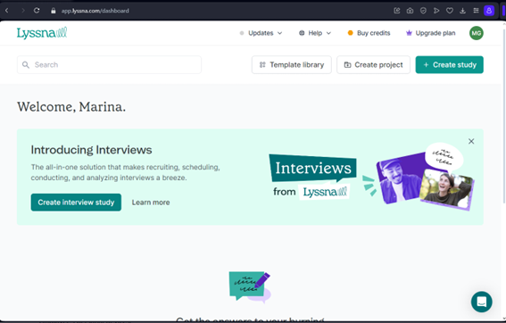

2. Accede a la página web para añadir un test de prueba. 
    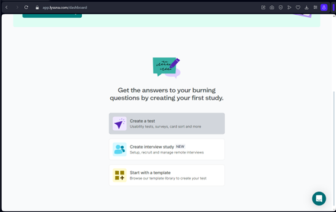

3. Modifica la prueba
    1. Añade los datos de detalles de prueba:
        1. **Nombre:** Prueba.
        2. **Idioma:** español
        3. **Proyecto:** (Nombre/ubicación)
        4. **Permitir la participación en:** Sólo escritorio 
        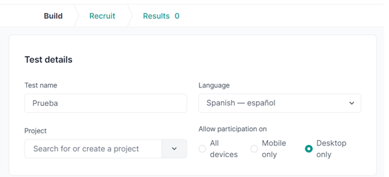
    
    2. Añade las siguientes secciones: 
        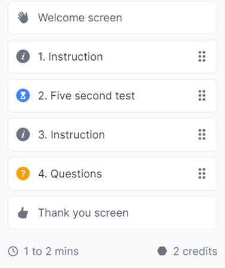
    
    - > **Note**:
    - > En este caso dará un tiempo estimado para responder preguntas. Sin embargo, no toma en cuenta el tiempo si la actividad de la instrucción es breve o no.

        1. Instrucciones 
            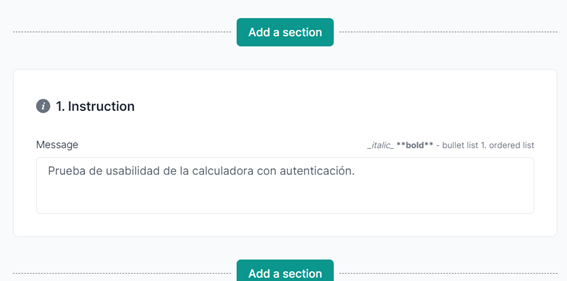

        2. Test de 5 segundos 
            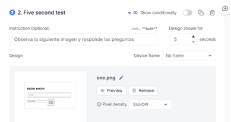
            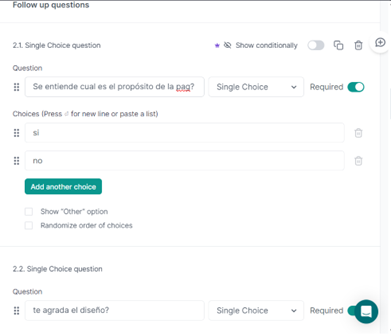
            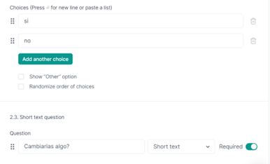
        
        3. Instrucciones 
            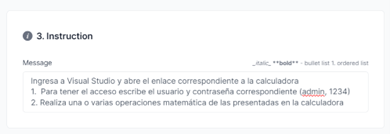
        
        4. Preguntas 
            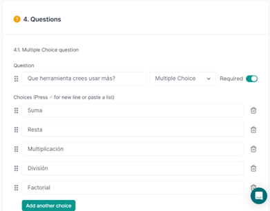
            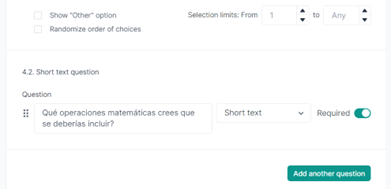
            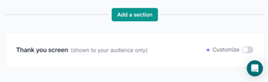

4. Verifica que la prueba contenga toda la información necesaria. Guarda y revisa el preliminar. 
    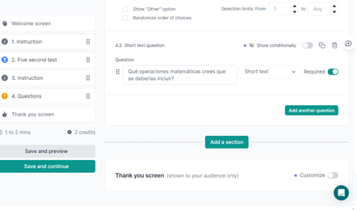

    1. Se abrirá una página nueva, señalando por medio de un botón azul si se desea avanzar (se muestran sólo unas capturas de cómo se ve el preliminar). 
    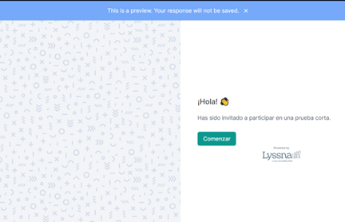
    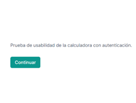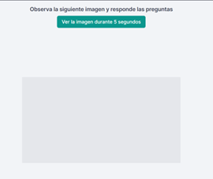

5. Guarda y continúa.
    1. Ya que se validó que las preguntas estuvieran bien, o en caso de haber realizado modificaciones, procede a continuar.
    2. Se abrirá una página nueva, dando la opción de si deseamos acceder al test desde más de 530k participantes o continuamos con un link de Lyssna.
    3. Seleccionamos el link de Lyssna. 
    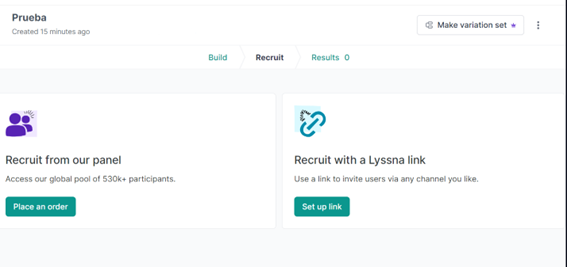

    4. Seleccionamos **Habilitar link**.  
    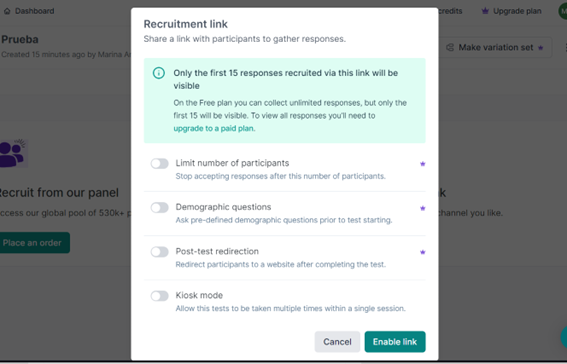

    5. Se muestra un link para compartir y la cantidad de respuestas. 
    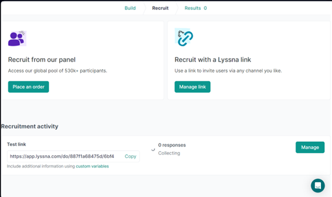

    6. Abre el link y responde las preguntas. 
    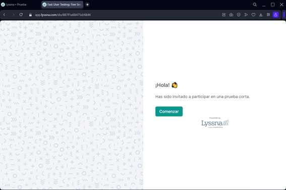

    7. Al terminar, se mostrará el siguiente mensaje: 
    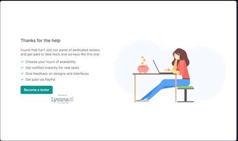

    8. Regresa a la página de Lyssna. Se deberá mostrar la respuesta realizada 
    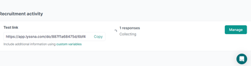

    9. Da clic en Resultados.  
    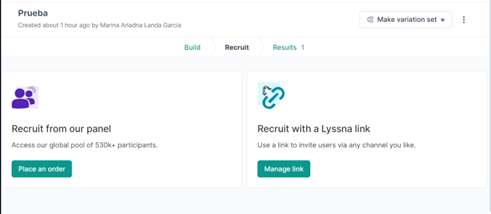

    10. Se mostrará una página con la cantidad de respuestas, país de donde se respondió, si se desea exportar, compartir o ver las respuestas realizadas. 
    

### Solución o producto final:
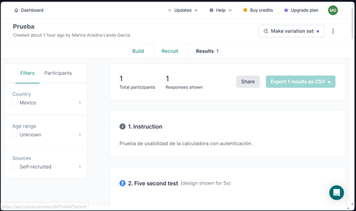

