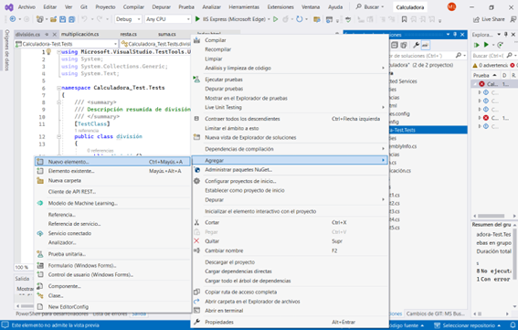
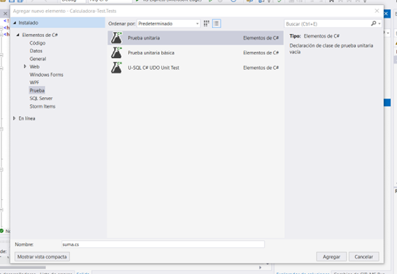
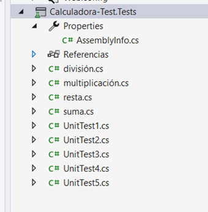
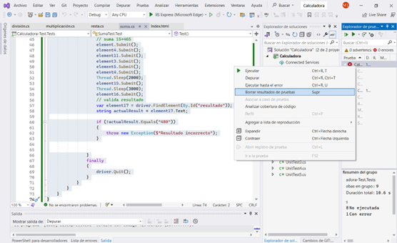
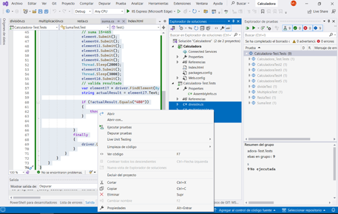
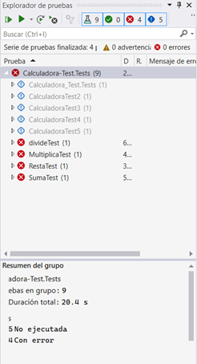
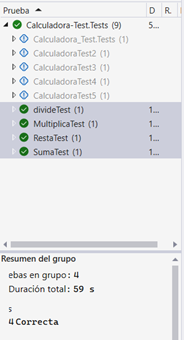

# Capítulo 8. Herramientas de Automatización de Pruebas
## Calculadora VI

## Objetivos
- Ejecutar las pruebas unitarias para validar el funcionamiento de la calculadora de forma automática.


### Duración aproximada: 40 minutos


## Instrucciones 
Se realizará la automatización de pruebas unitarias para validar las funciones de: suma, resta, multiplicación y división.

> [!NOTE]  
> Las herramientas para este ejercicio ya fueron usadas para pruebas anteriores. En este caso, se desea ampliar la práctica de la automatización.


1. Abre **Visual Studio**
2. Añade 4 pruebas y nómbralas: suma, resta, multiplicación y división.<br>
    
    

3. El proyecto de pruebas se verá de la siguiente forma:<br>
    

4. Selecciona el archivo **Suma**
    1. Añade el código de prueba correspondiente a la suma.
    ```C#
    using NUnit.Framework;
    using OpenQA.Selenium;
    using OpenQA.Selenium.Edge;
    using System.Threading;
    using System;

    namespace SumaTest
    {
        [TestFixture]
        public class Test
        {
            private readonly string site;

            public Test()
            {
                //Sigue las instrucciones para añadir la liga de acuerdo a tu computador
                site = "file:///C:/Users/MarinaLanda/source/repos/Calculadora/Calculadora/Index.html";
            }

            [Test]
            public void CalcularFactorial()
            {
                using (var driver = new EdgeDriver())
                {
                    try
                    {
                        driver.Url = site;
                        var element = driver.FindElement(By.Id("button1"));
                        var element1 = driver.FindElement(By.Id("button2"));
                        var element2 = driver.FindElement(By.Id("button3"));
                        var element3 = driver.FindElement(By.Id("button4"));
                        var element4 = driver.FindElement(By.Id("button5"));
                        var element5 = driver.FindElement(By.Id("button6"));
                        var element6 = driver.FindElement(By.Id("button7"));
                        var element7 = driver.FindElement(By.Id("button8"));
                        var element8 = driver.FindElement(By.Id("button9"));
                        var element9 = driver.FindElement(By.Id("button0"));
                        var element11 = driver.FindElement(By.Id("buttonsuma"));
                        var element12 = driver.FindElement(By.Id("buttonresta"));
                        var element13 = driver.FindElement(By.Id("buttonmultiplica"));
                        var element14 = driver.FindElement(By.Id("buttondivide"));
                        var element15 = driver.FindElement(By.Id("buttoncalcula"));
                        var element16 = driver.FindElement(By.Id("buttonborra"));
                        
                        // suma 15+465
                        element.Submit();
                        element4.Submit();
                        element11.Submit();
                        element3.Submit();
                        element5.Submit();
                        element4.Submit();
                        Thread.Sleep(2000);
                        element15.Submit();
                        Thread.Sleep(3000);
                        element16.Submit();
                        // valida resultado
                        var element17 = driver.FindElement(By.Id("resultado"));
                        string actualResult = element17.Text;

                        if (!actualResult.Equals("480"))
                        {
                            throw new Exception($"Resultado incorrecto");
                        }
                    }
                    finally
                    {
                        driver.Quit();
                    }
                }
            }
        }
    }
    ```

5. Selecciona el archivo _Resta_.
    1. Añade el código de prueba correspondiente a la resta.
    ```C#
    using NUnit.Framework;
    using OpenQA.Selenium;
    using OpenQA.Selenium.Edge;
    using System.Threading;
    using System;

    namespace RestaTest
    {
        [TestFixture]
        public class Test
        {
            private readonly string site;

            public Test()
            {
                //Sigue las instrucciones para añadir la liga de acuerdo a tu computador
                site = "file:///C:/Users/MarinaLanda/source/repos/Calculadora/Calculadora/Index.html";
            }

            [Test]
            public void CalcularFactorial()
            {
                using (var driver = new EdgeDriver())
                {
                    try
                    {
                        driver.Url = site;
                        var element = driver.FindElement(By.Id("button1"));
                        var element1 = driver.FindElement(By.Id("button2"));
                        var element2 = driver.FindElement(By.Id("button3"));
                        var element3 = driver.FindElement(By.Id("button4"));
                        var element4 = driver.FindElement(By.Id("button5"));
                        var element5 = driver.FindElement(By.Id("button6"));
                        var element6 = driver.FindElement(By.Id("button7"));
                        var element7 = driver.FindElement(By.Id("button8"));
                        var element8 = driver.FindElement(By.Id("button9"));
                        var element9 = driver.FindElement(By.Id("button0"));
                        var element11 = driver.FindElement(By.Id("buttonsuma"));
                        var element12 = driver.FindElement(By.Id("buttonresta"));
                        var element13 = driver.FindElement(By.Id("buttonmultiplica"));
                        var element14 = driver.FindElement(By.Id("buttondivide"));
                        var element15 = driver.FindElement(By.Id("buttoncalcula"));
                        var element16 = driver.FindElement(By.Id("buttonborra"));

                        // resta 1658-459
                        element.Submit();
                        element5.Submit();
                        element4.Submit();
                        element7.Submit();
                        element12.Submit();
                        element3.Submit();
                        element4.Submit();
                        element8.Submit();
                        Thread.Sleep(2000);
                        element15.Submit();
                        Thread.Sleep(3000);
                        element16.Submit();
                        // valida resultado
                        var element17 = driver.FindElement(By.Id("resultado"));
                        string actualResult = element17.Text;

                        if (!actualResult.Equals("1199"))
                        {
                            throw new Exception($"Resultado incorrecto");
                        }


                    }
                    finally
                    {
                        driver.Quit();
                    }
                }
            }
        }
    }
    ```

6. Selecciona el archivo _Multiplicación._
    1. Añade el código de prueba correspondiente a la multiplicación.
    ```C#
    using NUnit.Framework;
    using OpenQA.Selenium;
    using OpenQA.Selenium.Edge;
    using System.Threading;
    using System;

    namespace MultiplicaTest
    {
        [TestFixture]
        public class Test
        {
            private readonly string site;

            public Test()
            {
                //Sigue las instrucciones para añadir la liga de acuerdo a tu computador
                site = "file:///C:/Users/MarinaLanda/source/repos/Calculadora/Calculadora/Index.html";
            }

            [Test]
            public void CalcularFactorial()
            {
                using (var driver = new EdgeDriver())
                {
                    try
                    {
                        driver.Url = site;
                        var element = driver.FindElement(By.Id("button1"));
                        var element1 = driver.FindElement(By.Id("button2"));
                        var element2 = driver.FindElement(By.Id("button3"));
                        var element3 = driver.FindElement(By.Id("button4"));
                        var element4 = driver.FindElement(By.Id("button5"));
                        var element5 = driver.FindElement(By.Id("button6"));
                        var element6 = driver.FindElement(By.Id("button7"));
                        var element7 = driver.FindElement(By.Id("button8"));
                        var element8 = driver.FindElement(By.Id("button9"));
                        var element9 = driver.FindElement(By.Id("button0"));
                        var element11 = driver.FindElement(By.Id("buttonsuma"));
                        var element12 = driver.FindElement(By.Id("buttonresta"));
                        var element13 = driver.FindElement(By.Id("buttonmultiplica"));
                        var element14 = driver.FindElement(By.Id("buttondivide"));
                        var element15 = driver.FindElement(By.Id("buttoncalcula"));
                        var element16 = driver.FindElement(By.Id("buttonborra"));

                        // multiplica 48*9
                        element3.Submit();
                        element7.Submit();
                        element13.Submit();
                        element8.Submit();
                        Thread.Sleep(2000);
                        element15.Submit();
                        Thread.Sleep(3000);
                        element16.Submit();
                        // valida resultado
                        var element17 = driver.FindElement(By.Id("resultado"));
                        string actualResult = element17.Text;

                        if (!actualResult.Equals("432"))
                        {
                            throw new Exception($"Resultado incorrecto");
                        }


                    }
                    finally
                    {
                        driver.Quit();
                    }
                }
            }
        }
    }
    ```

7. Selecciona el archivo _División._
    1. Añade el código de prueba correspondiente a la división.
    ```C#
    using NUnit.Framework;
    using OpenQA.Selenium;
    using OpenQA.Selenium.Edge;
    using System.Threading;
    using System;
    namespace divideTest
    {
        [TestFixture]
        public class Test
        {
            private readonly string site;

            public Test()
            {
                //Sigue las instrucciones para añadir la liga de acuerdo a tu computador
                site = "file:///C:/Users/MarinaLanda/source/repos/Calculadora/Calculadora/Index.html";
            }

            [Test]
            public void CalcularFactorial()
            {
                using (var driver = new EdgeDriver())
                {
                    try
                    {
                        driver.Url = site;
                        var element = driver.FindElement(By.Id("button1"));
                        var element1 = driver.FindElement(By.Id("button2"));
                        var element2 = driver.FindElement(By.Id("button3"));
                        var element3 = driver.FindElement(By.Id("button4"));
                        var element4 = driver.FindElement(By.Id("button5"));
                        var element5 = driver.FindElement(By.Id("button6"));
                        var element6 = driver.FindElement(By.Id("button7"));
                        var element7 = driver.FindElement(By.Id("button8"));
                        var element8 = driver.FindElement(By.Id("button9"));
                        var element9 = driver.FindElement(By.Id("button0"));
                        var element11 = driver.FindElement(By.Id("buttonsuma"));
                        var element12 = driver.FindElement(By.Id("buttonresta"));
                        var element13 = driver.FindElement(By.Id("buttonmultiplica"));
                        var element14 = driver.FindElement(By.Id("buttondivide"));
                        var element15 = driver.FindElement(By.Id("buttoncalcula"));
                        var element16 = driver.FindElement(By.Id("buttonborra"));

                        // divide 520/8
                        element4.Submit();
                        element1.Submit();
                        element9.Submit();
                        element14.Submit();
                        element7.Submit();
                        Thread.Sleep(2000);
                        element15.Submit();
                        Thread.Sleep(3000);
                        element16.Submit();
                        // valida resultado
                        var element17 = driver.FindElement(By.Id("resultado"));
                        string actualResult = element17.Text;

                        if (!actualResult.Equals("65"))
                        {
                            throw new Exception($"Resultado incorrecto");
                        }


                    }
                    finally
                    {
                        driver.Quit();
                    }
                }
            }
        }
    }
    ```

8. Borra los datos de pruebas anteriores.
    1. Da clic derecho sobre el proyecto de pruebas en explorador de pruebas y selecciona **Borrar resultados de pruebas.**<br>
      

9. Ejecuta las pruebas y valida que estas funcionen correctamente.
    1. Selecciona las 4 pruebas (suma, resta, multiplicación y división).
    2. Da clic derecho sobre ellas y selecciona Ejecutar pruebas.<br>
     

        1. Todas se mostrarán con error, ya que no se añadió la parte de ingresar los datos de acceso a la calculadora.<br>
         
        2. Se añade el siguiente código en las 4 pruebas anteriores.

        ```javascript
        string usuario = "admin";
        string contraseña = "1234";
        var element18 = driver.FindElement(By.Id("username"));
        var element19 = driver.FindElement(By.Id("password"));
        var element20 = driver.FindElement(By.Id("submit"));
        element18.SendKeys(usuario);
        element19.SendKeys(contraseña);
        Thread.Sleep(2000);
        element20.Click();
        Thread.Sleep(2000);
        ```

        3. Borra resultados de pruebas.
        4. Se vuelven a ejecutar las pruebas.
        5. Valida que las pruebas funcionen correctamente.<br>
     


### Solución o producto final


