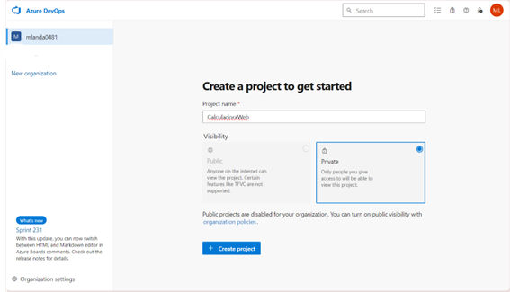
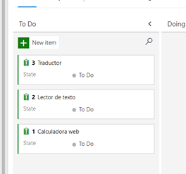
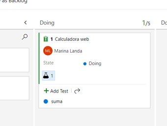

# Capítulo 9. Pruebas en Entornos DevOps
## Calculadora VII

## Objetivos
Al finalizar la práctica, serás capaz de:
- Descubrir el uso de pruebas en entornos DevOps e integrar al ejercicio de calculadora.

### Duración aproximada: 45 minutos

## Instrucciones 

1. Accede a Azure DevOps
2. Agrega una nueva organización.
3. Ingresa el nombre dle proyecto: "_CalculadoraWeb_" 

    

4. Selecciona **Crear proyecto** 

    

5. Conecta Visual Studio a Git.
    1. Abre Visual Studio.
    2. Selecciona en el menú superior "**Git**" y "**Clonar repositorio**".
        

    3. Selecciona en **Examinar un repositorio Azure**

        
    
    4. Selecciona al que se añadió en DevOps. 
    5. Selecciona **Clonar**

        
    
    6. Solicitará la información para validar la cuenta.  
        
    
    7. El proyecto está clonado, selecciona la solución _CalculadoraWeb_
        1. Valida que se pueda acceder a la página web. Se mostrará la siguiente versión de la calculadora. 
            

6. Regresa a Azure DevOps. Se mostrará en Files la documentación correspondiente a la calculadora web.
    

7. Explora el área de repos.

8. Selecciona en el menú izquierdo **Boards** y **Boards**. En este apartado, encontrarás todas las actividades del equipo divididas en: Por hacer, haciendo y terminadas.  
    

    1. Añadiremos actividades
        - Selecciona **Añadir item** 
            

        - Añade los siguientes items:
            > - Calculadora web
            > - Lector de texto
            > - Traductor

            

        - Configura **Calculadora Web**
            - Selecciona **Calculadora web** 
            

            - Asígnate la actividad
            - Añade una descripción de la actividad
            - Coloca la prioridad 1.
            - Cierra y guarda. 
            

            - Lleva _Calculadora web_ a "**Doing**" 
            

    
    2. Agrega una prueba
        - Del menú de la izquierda, selecciona **Test plans**
        - Selecciona **New test plan** 
        

        - Ingresa el nombre de "_Pruebas unitarias_" y selecciona "**Crear**" 
        

        - Añade un **Nuevo caso de prueba** 
        

        - Ingresa el título "_Suma_"
        - Añade los pasos de la prueba de suma.  
        

        - Selecciona **Guardar** y modifica el estatus a **Listo** 
        

        - Selecciona **Guardar**
    
    3. Añadimos el caso de prueba a _Calculadora web_

        - Seleccionamos **Añadir link** y da clic en **Item existente** 
        

        - Selecciona **Test** a _Calculadora web_ y da clic en **Ok** 
         

        - Selecciona **Guardar y cerrar**
    
    4. Valida la información en **Boards** 
    

    5. Añade los casos de prueba de resta, multiplicación y división. 
  
### Solución o producto final

